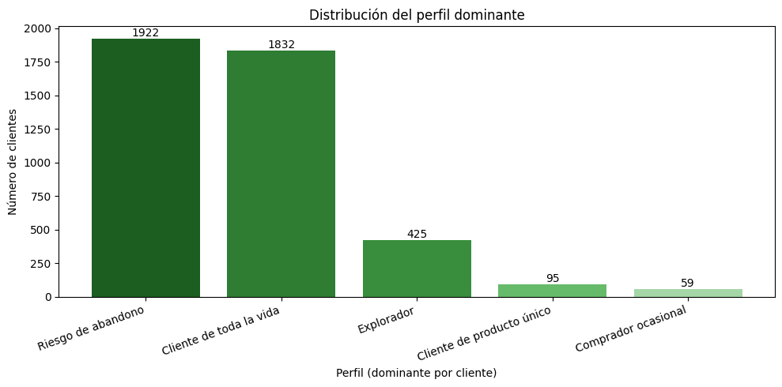
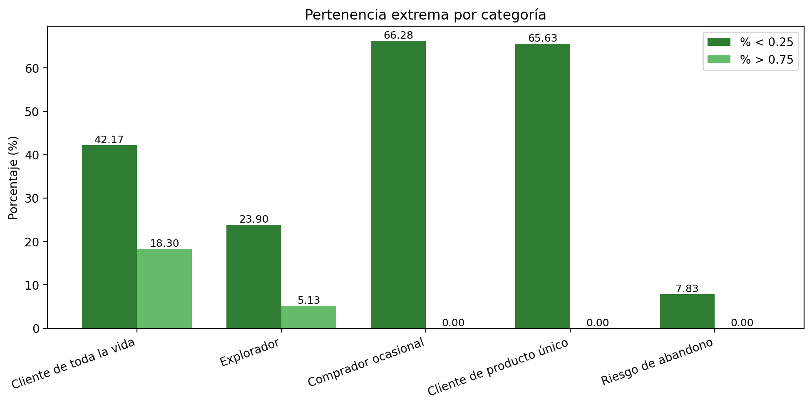
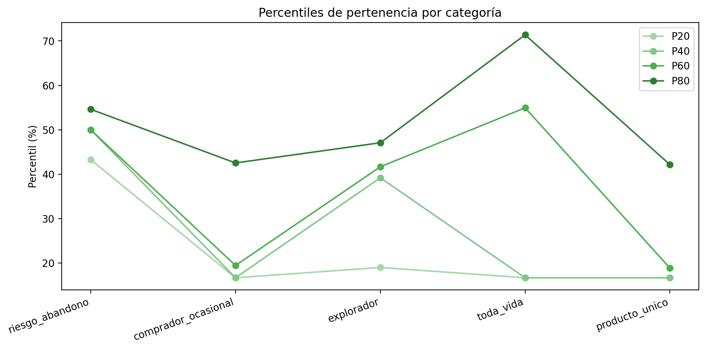

<div align="center">

# Práctica 1 — Lógica Difusa (Fuzzy Logic)
### Segmentación difusa de clientes en retail

**Laboratorio de Inteligencia Artificial** — **Universidad de Deusto** (curso 2025/2026)  
Implementación en **Google Colab** de un **sistema de inferencia difusa** para perfilar clientes basándose en métricas reales de compra.

<p>
  
  
  
  
  
  
</p>

</div>

---

## Quickstart

> Ejecuta el notebook en Google Colab:

[](https://colab.research.google.com/drive/1ruykcEmRXXTY-H-4MhMYp8vauJ88DJfW)

Output generado: `data/processed/clientes_clasificados.csv`

---

## Tabla de contenidos

- [1. Contexto y objetivo](#1-contexto-y-objetivo)
- [2. Dataset](#2-dataset)
- [3. Fundamentos teóricos](#3-fundamentos-teóricos)
- [4. Variables lingüísticas del sistema](#4-variables-lingüísticas-del-sistema)
- [5. Sistema de inferencia difuso](#5-sistema-de-inferencia-difuso)
- [6. Reglas difusas](#6-reglas-difusas)
- [7. Resultados](#7-resultados)
- [8. Estructura del proyecto](#8-estructura-del-proyecto)
- [9. Instalación y uso](#9-instalación-y-uso)
- [10. Autoría](#10-autoría)

---

## 1. Contexto y objetivo

En retail, el comportamiento de los clientes rara vez puede describirse con reglas rígidas.
Por ejemplo: ¿realmente existe una frontera clara entre “cliente frecuente” y “cliente no frecuente”?

En **lógica clásica** un elemento pertenece o no pertenece a un conjunto (0 o 1).  
En cambio, en **lógica difusa** un elemento puede pertenecer a un conjunto con un **grado** entre 0 y 1, permitiendo transiciones suaves y más realistas.

> “There are no whole truths; all truths are half-truths.” — A. N. Whitehead  

**Objetivo de la práctica:**  
Diseñar e implementar un **sistema difuso Mamdani** que segmente clientes según su historial de compra y calcule el grado de pertenencia a cinco perfiles interpretables:

- **Riesgo de abandono**
- **Comprador ocasional**
- **Explorador**
- **Cliente de toda la vida**
- **Cliente de producto único**

---

## 2. Dataset

El trabajo parte del dataset transaccional `retail.csv` y genera un dataset agregado por cliente.

Output final: `clientes_clasificados.csv`

- **4333 clientes**
- **17 columnas**
- Incluye métricas agregadas + pertenencias difusas a perfiles

---

## 3. Fundamentos teóricos

La lógica difusa (Zadeh, 1965) permite formalizar conocimiento lingüístico y tratar conceptos con fronteras difusas como:

- “alto”, “bajo”
- “reciente”, “lejano”
- “frecuente”, “ocasional”

Esto se implementa mediante:

### 3.1 Conjuntos difusos y funciones de pertenencia

Un conjunto difuso se define mediante una **función de pertenencia**:

- Eje X: universo de discurso
- Eje Y: grado de pertenencia μ(x) ∈ [0, 1]

En esta práctica se usan funciones habituales (triangulares/trapezoidales), por su interpretabilidad y simplicidad.

### 3.2 Operadores difusos

Para combinar condiciones en reglas se usan operadores:

- **AND** → T-norma
- **OR** → T-conorma
- **NOT** → complemento

---

## 4. Variables lingüísticas del sistema

Una variable lingüística tiene valores tipo “palabras”, no números (por ejemplo: *Frecuencia = Alta*).
Esto permite representar conocimiento cuando una frontera matemática exacta es difícil.

### 4.1 Features (métricas agregadas por cliente)

Para cada cliente se calculan métricas como:

- `total_compras`
- `total_gasto`
- `gasto_medio`
- `variedad`
- `antiguedad`
- `meses_activos`
- `frecuencia`
- `dias_ultima_compra`
- `productos_repetidos`

Cada métrica se transforma en etiquetas lingüísticas (ej.: baja/media/alta) mediante funciones de pertenencia.

### 4.2 Outputs (perfiles)

El sistema devuelve un score (0–100 aprox.) interpretado como pertenencia a:

- `riesgo_abandono_val`
- `comprador_ocasional_val`
- `explorador_val`
- `toda_vida_val`
- `producto_unico_val`

---

## 5. Sistema de inferencia difuso

La práctica implementa un pipeline completo:

```mermaid
flowchart LR
    DATA[("retail.csv<br/>transacciones")]
    PRE["Preprocesado + agregación<br/>(Pandas)"]
    FUZZ["Fuzzificación<br/>(μ(x) ∈ [0,1])"]
    RULES["Inferencia"]
    AGG["Agregación de reglas"]
    DEFUZZ["Defuzzificación"]
    OUT[("clientes_clasificados.csv<br/>perfiles")]

    DATA --> PRE --> FUZZ --> RULES --> AGG --> DEFUZZ --> OUT
    style RULES fill:#eef7ff,stroke:#2b6cb0,stroke-width:2px
````

Etapas clave:

1. **Fuzzificación**: asigna grados a etiquetas lingüísticas
2. **Inferencia**: evalúa reglas con AND/OR/NOT
3. **Implicación**: traslada activación del antecedente al consecuente
4. **Agregación**: combina salidas de reglas
5. **Defuzzificación**: obtiene un valor concreto (centroide)

---

## 6. Reglas difusas

La base de conocimiento se codifica mediante reglas IF–THEN del tipo:

> IF <proposición difusa> THEN <proposición difusa>

Ejemplos conceptuales:

| # | Antecedente (IF) | Consecuente (THEN) | Interpretación |
|---:|---------------- |--------------------|----------------|
| 1 | `dias_ultima_compra` es **alto** | `riesgo_abandono` es **alto** | Si hace mucho que no compra, aumenta el riesgo |
| 2 | `antiguedad` es **alta** **AND** `frecuencia` es **alta** | `toda_vida` es **alto** | Cliente consolidado y recurrente |
| 3 | `variedad` es **alta** | `explorador` es **alto** | Compra diversidad de productos |
| 4 | `productos_repetidos` es **alto** **AND** `variedad` es **baja** | `producto_unico` es **alto** | Se centra en un producto/hábito |
| 5 | `frecuencia` es **baja** **AND** `gasto_medio` es **bajo** | `comprador_ocasional` es **alto** | Compra poco y con bajo valor |


En la implementación se definen **15 reglas**.

---

## 7. Resultados

### 7.1 Distribución del perfil dominante

Para cada cliente se identifica su **perfil dominante**, es decir, la categoría con **mayor grado de pertenencia difusa**.

Distribución obtenida:

- **Riesgo de abandono:** 1922 clientes
- **Cliente de toda la vida:** 1832 clientes
- **Explorador:** 425 clientes
- **Cliente de producto único:** 95 clientes
- **Comprador ocasional:** 59 clientes

<div align="center">
  
  <p><i>Distribución de clientes según el perfil con mayor pertenencia.</i></p>
</div>

---

### 7.2 Estadísticas de pertenencia (extremos y percentiles)

Además de la categoría dominante, se han analizado las distribuciones de pertenencia para identificar:

- **Pertenencias extremas**: porcentaje de clientes con pertenencia muy baja (< 0.25) o muy alta (> 0.75)
- **Percentiles (P20, P40, P60, P80)**: indicadores de cómo se reparte la pertenencia dentro de cada perfil

#### 7.2.1 Pertenencia extrema por perfil

<div align="center">
  
  <p><i>Porcentaje de clientes con pertenencia extrema (<0.25 y >0.75) para cada perfil.</i></p>
</div>

#### 7.2.2 Percentiles de pertenencia por perfil

<div align="center">
  
  <p><i>Percentiles de pertenencia (P20/P40/P60/P80) para cada perfil.</i></p>
</div>

---

### 7.3 Output final

El sistema genera un dataset final agregado por cliente:

`data/processed/clientes_clasificados.csv`

Este fichero incluye:

- **Features agregadas** calculadas a partir de `retail.csv`
- **Grados de pertenencia** a cada uno de los perfiles difusos:
  - Riesgo de abandono
  - Comprador ocasional
  - Explorador
  - Cliente de toda la vida
  - Cliente de producto único


---

## 8. Estructura del proyecto

```text
P01-logica_difusa/
├── data/
│   ├── raw/retail.csv
│   └── processed/
│       └── clientes_clasificados.csv
├── docs/
│   └── images/
│       └── perfiles_dominantes.png
├── notebook/
│   └── Practica_01_Fuzzy_Logic.ipynb
└── README.md
```

---

## 9. Instalación y uso

### Ejecución en Google Colab (recomendado)

1. Abre el notebook en Colab

2. Sube el archivo **`retail.csv`** al entorno de Colab:
   - Panel izquierdo → **Files**
   - Botón **Upload**
   - Selecciona `retail.csv`

3. Ejecuta todas las celdas en orden (**Runtime → Run all**).

Al finalizar, el notebook genera el fichero de salida:

- `clientes_clasificados.csv` (clientes con métricas agregadas + perfiles difusos)

---

## 10. Autoría

Práctica realizada por 
* **Katrin Muñoz Errasti**
* **Asier Burgos**
* **Ander Perez**
Universidad de Deusto — Laboratorio de Inteligencia Artificial (2025/2026)
