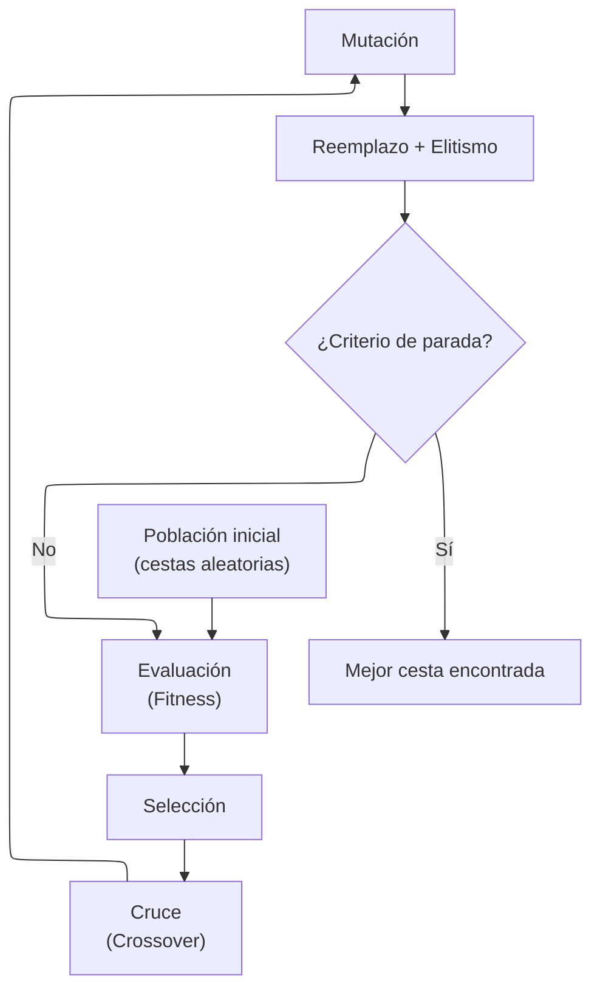
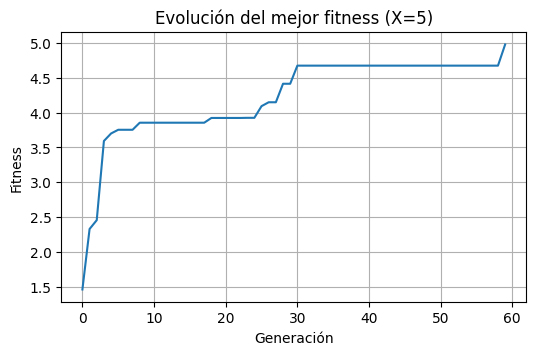
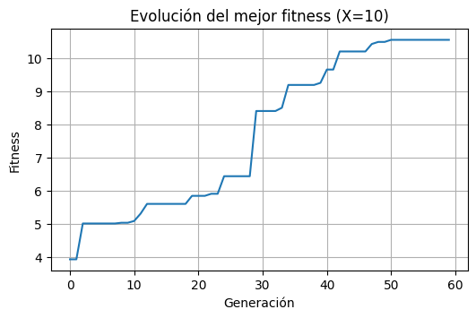
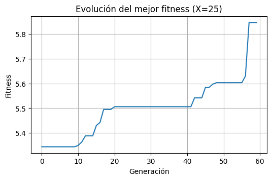
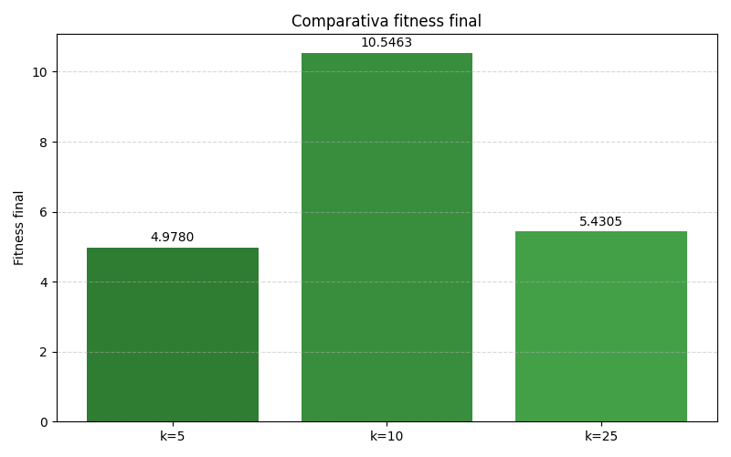

<div align="center">

# Práctica 2 — Algoritmos Genéticos (Genetic Algorithms)

### Optimización de Cestas de Productos en Retail (Combinatorial Optimization)

**Laboratorio de Inteligencia Artificial** — **Universidad de Deusto** (curso 2025/2026)
Implementación en **Google Colab** de un **Algoritmo Genético (GA)** para resolver un problema real de **optimización combinatoria**: seleccionar una cesta de productos maximizando **rentabilidad esperada** y **diversidad**.

<p>
  
  
  
  
  
</p>

</div>

---


## ⚡ Quickstart

> Ejecuta el notebook directamente en Google Colab:

[](https://colab.research.google.com/drive/1cIxw0WI3K3NtY1zSIRw_XrghZezxTzq5)

**IMPORTANTE:** antes de ejecutar, sube `retail.csv` al entorno de Colab:
Panel izquierdo → **Files** → **Upload** → selecciona `retail.csv`

**Input:** `data/raw/retail.csv`
**Objetivo:** encontrar la mejor combinación de **k productos** (ej. k=5,10,25) que equilibre **valor comercial** y **diversidad**.

---

## Tabla de contenidos

* [1. Contexto del problema](#1-contexto-del-problema)
* [2. Optimización y explosión combinatoria](#2-optimización-y-explosión-combinatoria)
* [3. Preparación de datos](#3-preparación-de-datos)
* [4. Formulación del problema](#4-formulación-del-problema)
* [5. Arquitectura del Algoritmo Genético](#5-arquitectura-del-algoritmo-genético)
* [6. Representación del cromosoma](#6-representación-del-cromosoma)
* [7. Función de fitness (aptitud)](#7-función-de-fitness-aptitud)
* [8. Operadores genéticos](#8-operadores-genéticos)
* [9. Parámetros del GA](#9-parámetros-del-ga)
* [10. Resultados experimentales](#10-resultados-experimentales)
* [11. Estructura del proyecto](#11-estructura-del-proyecto)
* [12. Autoría](#12-autoría)

---

## 1. Contexto del problema

En **retail / e-commerce**, recomendar productos no consiste únicamente en sugerir los más vendidos.
Una buena recomendación debe equilibrar:

* **Rentabilidad comercial**: productos con mayor margen esperado
* **Diversidad de catálogo**: evitar redundancia (ej. recomendar 5 productos de la misma familia)

Esta práctica implementa un **Algoritmo Genético (GA)** para construir automáticamente una **cesta óptima de tamaño fijo** `k` (ej. 5, 10, 25 productos), maximizando utilidad y manteniendo diversidad.

---

## 2. Optimización y explosión combinatoria

Un problema de optimización puede expresarse como:

$$
\max \{ f(x) \mid x \in X \subseteq S \}
$$


donde:

* (S) es el espacio total de soluciones
* (X) son las soluciones factibles
* (x) es una solución candidata

En problemas discretos, elegir una cesta de tamaño (k) dentro de un catálogo de miles de productos produce **explosión combinatoria**:

$$
\binom{N}{k}
$$

Esto hace inviable la búsqueda exhaustiva y motiva el uso de heurísticas bioinspiradas como **Algoritmos Evolutivos**.

---

## 3. Preparación de datos

El dataset transaccional `retail.csv` se transforma en un dataset de productos agregados.

Para cada producto (`StockCode`) se calculan:

* `precio_medio`
* `num_clientes`
* `margen_unitario`
* `num_clientes_ult_mes`
* `prob_compra_ultimo_mes`

A partir de esto se obtiene el **valor esperado**:

$$
VE_i = MargenUnitario_i \cdot ProbCompraUltimoMes_i
$$


Además, cada producto se asigna a una **familia** en función de los primeros caracteres del `StockCode`.

En total se obtienen:

* **3784 productos** procesados

---

## 4. Formulación del problema

Se desea construir una cesta `x` con:

* **Cardinalidad fija:** (|x| = k)
* **Diversidad:** minimizar repetición de familias
* **Valor máximo:** maximizar suma de valores esperados

---

## 5. Arquitectura del Algoritmo Genético

El GA evoluciona una población de cestas basándose en selección natural:



---

## 6. Representación del cromosoma

Se usa representación binaria tipo **Knapsack-like**:

* Cromosoma: vector binario
* Gen (i): `1` si se selecciona el producto `i`, `0` si no

Ejemplo:

$$
x = [0,1,0,1,1,0,\dots]
$$

---

## 7. Función de fitness (aptitud)

La aptitud de una cesta combina:

1. **Rentabilidad esperada total**
2. **Restricciones mediante penalización**

$$
Fitness(Cesta) = \sum_{p \in cesta} (ProbCompra_p \times Margen_p)
$$

### Penalizaciones implementadas

**Penalización por cardinalidad**

* Si el individuo no tiene exactamente `k` productos → castigo fuerte

**Penalización por familias repetidas**

* Si hay demasiados productos de la misma familia → castigo creciente

> La familia del producto se infiere de los primeros caracteres del `StockCode`.

---

## 8. Operadores genéticos

Operadores principales:

* **Selección**: favorece individuos con mayor fitness
* **Cruce (crossover)**: combina genes de dos padres
* **Mutación**: altera genes aleatoriamente para explorar soluciones nuevas
* **Elitismo**: preserva el mejor individuo en cada generación

---

## 9. Parámetros del GA

Configuración utilizada en los experimentos:

| Parámetro            | Valor | Interpretación                      |
| -------------------- | ----: | ----------------------------------- |
| Tamaño población     |    80 | equilibrio entre diversidad y coste |
| Nº generaciones      |    60 | convergencia observada              |
| Prob. cruce (P_c)    |   0.9 | exploración combinatoria            |
| Prob. mutación (P_m) |   0.2 | evita mínimos locales               |
| Elitismo             |    Sí | conserva el mejor individuo         |

---

## 10. Resultados experimentales

Se realizaron experimentos para distintos tamaños de cesta:

* **k = 5**
* **k = 10**
* **k = 25**

### 10.1 Evolución del fitness

La convergencia del algoritmo puede observarse en las siguientes gráficas:

#### Evolución del mejor fitness (k = 5)

<div align="center">
  
  <p><i>Evolución del mejor fitness por generación para k=5.</i></p>
</div>

#### Evolución del mejor fitness (k = 10)

<div align="center">
  
  <p><i>Evolución del mejor fitness por generación para k=10.</i></p>
</div>

#### Evolución del mejor fitness (k = 25)

<div align="center">
  
  <p><i>Evolución del mejor fitness por generación para k=25.</i></p>
</div>

---

### 10.2 Resumen de resultados (k = 5, 10, 25)

Resultados finales obtenidos:

| Experimento |  k | Fitness final | Observación                                                        |
| ----------: | -: | ------------: | ------------------------------------------------------------------ |
|      Exp. 1 |  5 |    **4.9780** | cesta pequeña: diversidad fácil, fitness moderado                  |
|      Exp. 2 | 10 |   **10.5463** | mejor equilibrio: valor esperado alto y diversidad                 |
|      Exp. 3 | 25 |    **5.8882** | penalización alta por repetición/diversidad y productos de bajo VE |

Comparativa del fitness final:

<div align="center">
  
  <p><i>Comparación del fitness final para distintos tamaños de cesta.</i></p>
</div>

---

### 10.3 Mejor cesta encontrada

La mejor solución global encontrada en los experimentos fue:

* **Fitness:** **9.5693**
* **Productos:** `['22846', '23535', '84968d', 'DOT', 'M']`
* **Familias:** `['22', '23', '84', 'DO', 'M']`

Este resultado muestra un patrón consistente con el objetivo del problema:
alta rentabilidad esperada + diversidad estructural por familias.

---

## 11. Estructura del proyecto

```text
P02-algoritmos_geneticos/
├── data/
│   └── raw/
│       └── retail.csv
├── docs/
│   └── images/
├── notebook/
│   └── Practica_02_Algoritmo_Genetico.ipynb
└── README.md
```

---

## 12. Autoría

Práctica realizada por:

* **Katrin Muñoz Errasti**
* **Asier Burgos**
* **Ander Perez**

**Universidad de Deusto** — Laboratorio de Inteligencia Artificial (2025/2026)
