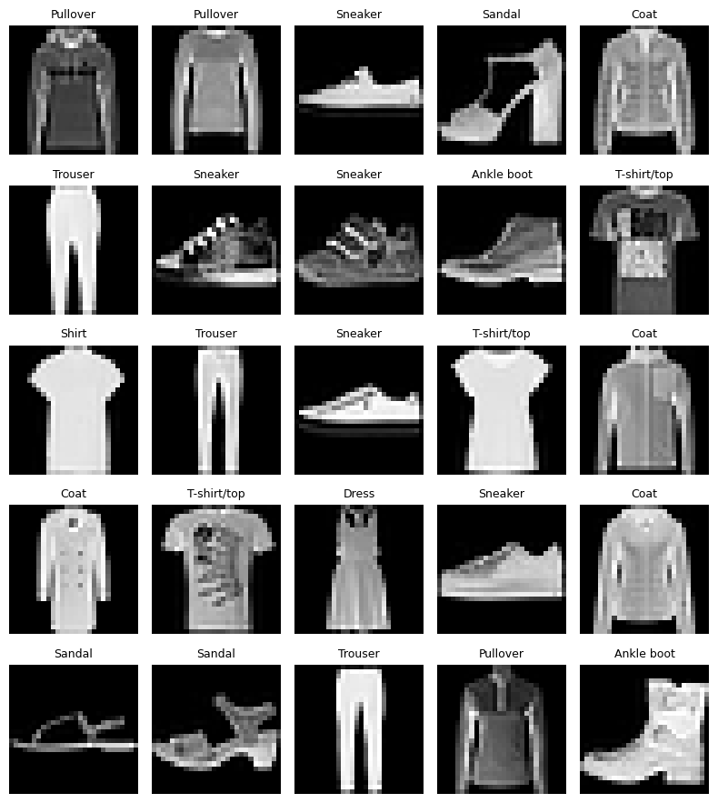
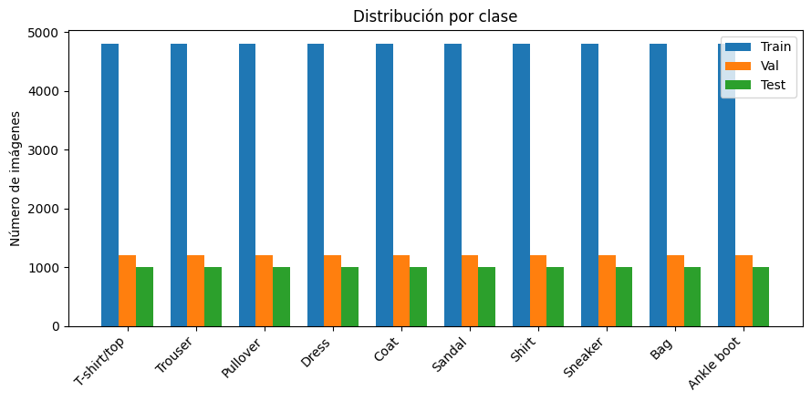
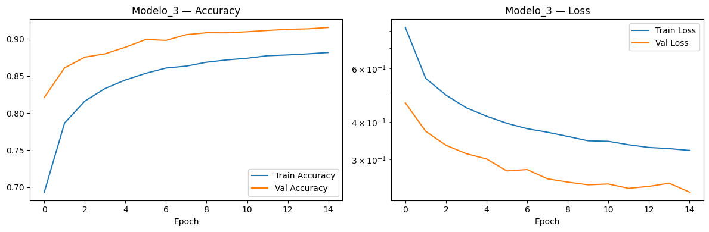
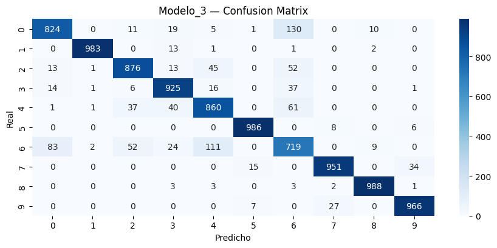
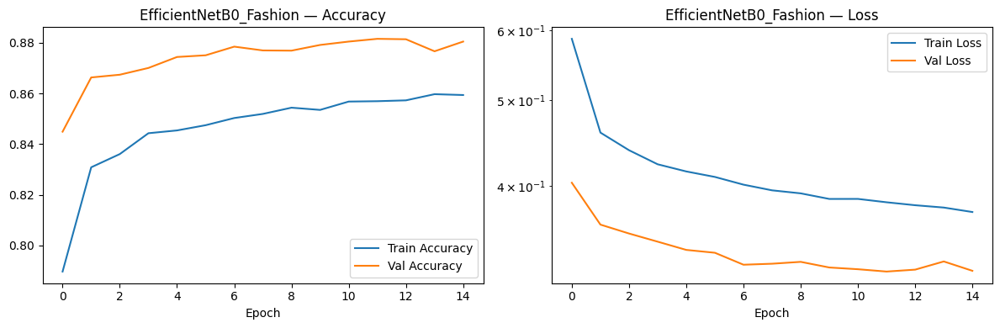
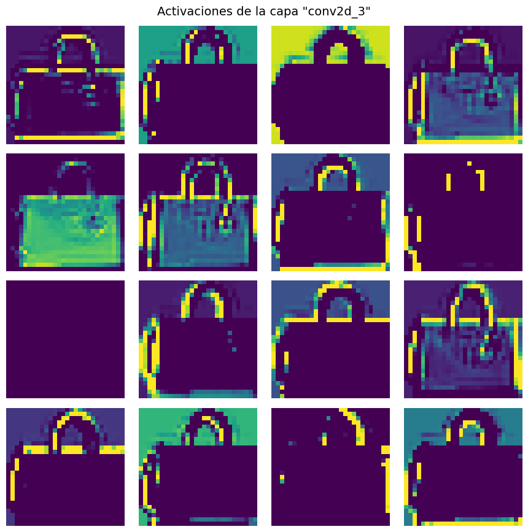

<div align="center">

# Práctica 3 — Image Processing (CNNs)

### Clasificación de Fashion-MNIST con *Data Augmentation* y **Transfer Learning**

**Laboratorio de Inteligencia Artificial** — **Universidad de Deusto** (curso 2025/2026)  
Implementación en **Google Colab** de un pipeline completo de **visión por computador** para **clasificación de imágenes** con **CNNs**, comparando **modelos entrenados desde cero** vs **redes preentrenadas** (ImageNet), e incluyendo **Ablation Study** y **visualización de activaciones**.

<p>
  
  
  
  
  
</p>

</div>

---

## ⚡ Quickstart

> Ejecuta el notebook directamente en Google Colab:

[](https://colab.research.google.com/drive/1jsZr0jfd-R1UQV-Abvkv_dDz1Wik-ysg?usp=sharing)


**Input:** Fashion-MNIST (28×28, grayscale)  
**Objetivo:** entrenar y comparar **CNNs** para clasificar 10 clases de prendas, maximizando rendimiento y generalización.

---

## Tabla de contenidos

* [1. Contexto del problema](#1-contexto-del-problema)
* [2. Dataset (Fashion-MNIST)](#2-dataset-fashion-mnist)
* [3. Preparación de datos y preprocesado](#3-preparación-de-datos-y-preprocesado)
* [4. Data augmentation](#4-data-augmentation)
* [5. Modelos implementados](#5-modelos-implementados)
* [6. Entrenamiento](#6-entrenamiento)
* [7. Evaluación](#7-evaluación)
* [8. Resultados experimentales](#8-resultados-experimentales)
* [9. Requisito extra 1 — Ablation Study](#9-requisito-extra-1--ablation-study)
* [10. Requisito extra 2 — Visualización de activaciones](#10-requisito-extra-2--visualización-de-activaciones)
* [11. Estructura del proyecto](#11-estructura-del-proyecto)
* [12. Autoría](#12-autoría)

---

## 1. Contexto del problema

La **clasificación de imágenes** es una tarea central en visión por computador: dada una imagen, queremos asignarla a una **clase**.

En este caso, el reto es clasificar prendas de ropa (Fashion-MNIST). Aunque el dataset es pequeño (28×28), permite trabajar un flujo completo de *Deep Learning*:

- **Preprocesado** y partición train/validación
- **Generalización** con *data augmentation*
- Diseño de **arquitecturas CNN**
- **Transfer Learning** con modelos preentrenados (ImageNet)
- Evaluación con métricas, curvas de aprendizaje y matriz de confusión
- Interpretabilidad: **activaciones** y análisis de errores

---

## 2. Dataset (Fashion-MNIST)

Fashion-MNIST contiene imágenes 28×28 en escala de grises y 10 clases:

`T-shirt/top, Trouser, Pullover, Dress, Coat, Sandal, Shirt, Sneaker, Bag, Ankle boot`

¿Por qué es útil?

- Es un dataset estándar para comparar CNNs.
- Tiene clases “parecidas” (por ejemplo, *Shirt* vs *T-shirt/top*), lo que obliga a aprender patrones visuales relevantes.

### 2.1 Ejemplos del dataset

<div align="center">
  
  <p><i>Muestra aleatoria de imágenes y etiquetas del dataset Fashion-MNIST.</i></p>
</div>

### 2.2 Distribución por clase

<div align="center">
  
  <p><i>Distribución de imágenes por clase en Train, Validation y Test.</i></p>
</div>

---

## 3. Preparación de datos y preprocesado

### 3.1 Normalización y codificación
- Normalización a rango **[0, 1]** para estabilizar el entrenamiento.
- Etiquetas en **one-hot encoding** para usar `categorical_crossentropy`.

### 3.2 División Train/Validación
Se realiza una partición **80/20** con `stratify` para mantener la distribución de clases en validación.

### 3.3 Adaptación para Transfer Learning (3 canales + resize)

Los modelos preentrenados en ImageNet esperan imágenes:
- **3 canales** (RGB)
- tamaños superiores a 28×28

Por eso:
1) Se repite el canal para pasar de (28×28×1) a (28×28×3).  
2) Se hace **resize a 96×96** para alimentar MobileNetV2/EfficientNetB0.  
3) Se aplica `preprocess_input` específico de cada backbone.

---

## 4. Data augmentation

Para mejorar generalización se usa `ImageDataGenerator` con transformaciones moderadas:

- `rotation_range = 15`
- `width_shift_range = 0.10`
- `height_shift_range = 0.10`
- `horizontal_flip = True`
- `zoom_range = 0.10`

**Motivación:** el *augmentation* fuerza al modelo a no memorizar y a aprender rasgos más robustos ante pequeñas variaciones (rotaciones, desplazamientos, zoom, etc.).

---

## 5. Modelos implementados

En la práctica se entrenan **6 modelos**:

- **Transfer Learning** (2 modelos con backbone congelado)
  - MobileNetV2
  - EfficientNetB0
- **CNNs propias** (4 modelos desde cero)
  - Baseline → VGG-like → VGG profundo → Profundo con BatchNorm

La comparación permite responder:  
**¿Es mejor usar un modelo preentrenado sin fine-tuning o diseñar una CNN adaptada a Fashion-MNIST?**

---

### 5.1 Transfer Learning

#### Modelo A — MobileNetV2 (backbone congelado)
**Por qué MobileNetV2:** red ligera, rápida y eficaz como baseline preentrenado.

**Estructura general:**
- Entrada 96×96×3 + `preprocess_input`
- Base MobileNetV2 (**frozen**)
- Head:
  - `GlobalAveragePooling2D`
  - `Dense(256, relu)`
  - `Dropout(0.5)`
  - `Dense(10, softmax)`

#### Modelo B — EfficientNetB0 (backbone congelado)
**Por qué EfficientNetB0:** backbone muy competitivo, suele mejorar a arquitecturas ligeras manteniendo eficiencia.

**Estructura general:**
- Entrada 96×96×3 + `preprocess_input`
- Base EfficientNetB0 (**frozen**)
- Head:
  - `GlobalAveragePooling2D`
  - `Dense(192, relu)`
  - `Dropout(0.4/0.3)`
  - `Dense(10, softmax)`

> Nota: al **no hacer fine-tuning**, el backbone no se adapta al dominio Fashion-MNIST. Esto reduce coste y riesgo de sobreajuste, pero puede limitar el rendimiento máximo.

---

### 5.2 CNNs desde cero (propias)

#### Modelo 1 — Baseline simple
**Objetivo:** referencia mínima.
- Conv(32) → MaxPool → Flatten → Dense(64) → Softmax

#### Modelo 2 — VGG-like compacto
**Objetivo:** más capacidad + regularización.
- Conv(32) → Conv(64) → MaxPool → Dropout(0.25)
- Flatten → Dense(128) → Dropout(0.5) → Softmax

#### Modelo 3 — VGG-like profundo (modelo principal)
**Objetivo:** extraer rasgos más ricos con profundidad moderada y dropout progresivo.
- Bloque 1: Conv(32)×2 → MaxPool → Dropout(0.2)
- Bloque 2: Conv(64)×2 → MaxPool → Dropout(0.3)
- Clasificador: Flatten → Dense(256) → Dropout(0.5) → Softmax

#### Modelo 4 — Profundo con BatchNorm
**Objetivo:** estabilizar entrenamiento y mejorar convergencia con Batch Normalization.
- 3 bloques (32/64/128) con: Conv → BatchNorm → ReLU (×2) → MaxPool → Dropout (0.2/0.3/0.4)
- Flatten → Dense(256) → BatchNorm → Dropout(0.5) → Softmax

---

## 6. Entrenamiento

Configuración común:

| Parámetro | Valor |
|---|---:|
| Batch size | 128 |
| Epochs | 15 |
| Optimizador | Adam |
| Loss | categorical_crossentropy |
| Métrica | accuracy |

Durante el entrenamiento se registran y visualizan:
- curvas de **accuracy** (train vs val)
- curvas de **loss** (train vs val)

---

## 7. Evaluación

Para cada modelo se calcula:
- **Test accuracy**
- `classification_report` (precision/recall/F1 por clase)
- **matriz de confusión** (errores más frecuentes entre clases similares)

---

## 8. Resultados experimentales

### 8.1 Comparativa de rendimiento (test accuracy)

| Modelo | Test accuracy | Comentario |
|---|---:|---|
| **Modelo 3 (VGG profundo)** | **0.9078** | Mejor equilibrio capacidad/regularización |
| Modelo 2 (VGG compacto) | 0.8948 | Buen rendimiento con menos profundidad |
| Modelo 4 (BatchNorm) | 0.8913 | Estable, pero no supera al Modelo 3 |
| EfficientNetB0 (frozen) | 0.8820 | Transfer learning competitivo sin fine-tuning |
| Modelo 1 (baseline) | 0.8601 | Referencia mínima |
| MobileNetV2 (frozen) | 0.8448 | Más ligero pero peor que EfficientNetB0 |

**Conclusión principal:**
- En este setup, las **CNNs propias (especialmente Modelo 3)** superan a los backbones preentrenados **congelados**.
- EfficientNetB0 > MobileNetV2, pero sin fine-tuning no alcanza al mejor modelo desde cero.

> Nota: si no se fijan semillas, es normal que haya pequeñas variaciones entre ejecuciones.

---

### 8.2 Curvas de entrenamiento — Mejor modelo (Modelo 3)

<div align="center">
  
  <p><i>Curvas de accuracy y loss para Train y Validation del Modelo 3.</i></p>
</div>

### 8.3 Matriz de confusión — Mejor modelo (Modelo 3)

<div align="center">
  
  <p><i>Matriz de confusión del Modelo 3 en test. Permite identificar confusiones entre clases similares.</i></p>
</div>

### 8.4 Comparativa visual (Transfer Learning vs CNN propia)

<div align="center">
  
  <p><i>Curvas de entrenamiento de EfficientNetB0 (backbone congelado). Comparación con Modelo 3.</i></p>
</div>

---

## 9. Requisito extra 1 — Ablation Study

Se analiza cuánto aporta cada componente del **Modelo 3** probando variantes controladas.

| Variante | Qué cambia | Test accuracy |
|---|---|---:|
| **Modelo_3_Ablation_Sin_Dropout** | elimina todos los Dropout | **0.9187** |
| Modelo_3_Ablation_un_Bloque | elimina Bloque 2 (64 filtros) | 0.8963 |
| Modelo_3_Ablation_con_GAP | cambia Flatten por GAP | 0.8608 |

<div align="center">
  
  <p><i>Ablation Study del Modelo 3: impacto de eliminar Dropout, reducir profundidad o usar GAP.</i></p>
</div>

**Lectura (según lo observado):**
- **Sin Dropout** mejora: con *augmentation* y un dataset “limpio”, el dropout puede regularizar demasiado.
- Quitar un bloque baja: menos capacidad para representar patrones.
- Con GAP baja: en 28×28 puede perderse información espacial útil.

---

## 10. Requisito extra 2 — Visualización de activaciones

Para entender *qué aprende* la CNN, se visualizan **feature maps** de capas convolucionales:

1) Se detectan las capas `conv2d*`.  
2) Se eligen capas representativas (temprana/intermedia/final).  
3) Se crea un modelo intermedio que devuelve sus salidas.  
4) Se muestran hasta **16 filtros** por capa.

Interpretación esperada:
- capas iniciales → bordes y texturas
- capas intermedias → patrones de forma
- capas finales → rasgos más abstractos ligados a la clase

<div align="center">
  
  <p><i>Activaciones de una capa convolucional (ejemplo: conv2d_3). Se observan filtros que resaltan bordes y contornos.</i></p>
</div>

---

## 11. Estructura del proyecto

```text
03-image-processing/
├── docs/
│   └── images/
│       ├── fashion_mnist_samples.png
│       ├── class_distribution.png
│       ├── accuracy_loss_modelo3.png
│       ├── confusion_matrix_modelo3.png
│       ├── accuracy_loss_efficientnetb0.png
│       ├── ablation_modelo_3_verde.png
│       └── activaciones_modelo3.png
├── notebook/
│   └── Práctica_03_Image_processing.ipynb
└── README.md
````

---

## 12. Autoría

Práctica realizada por:

* **Katrin Muñoz Errasti**

**Universidad de Deusto** — Laboratorio de Inteligencia Artificial (2025/2026)
