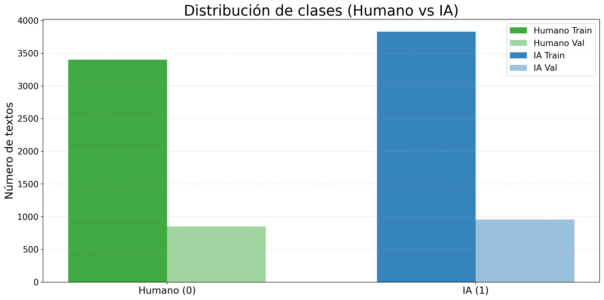
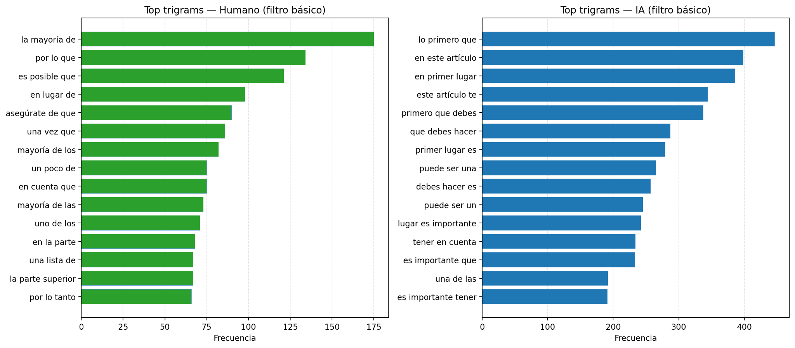
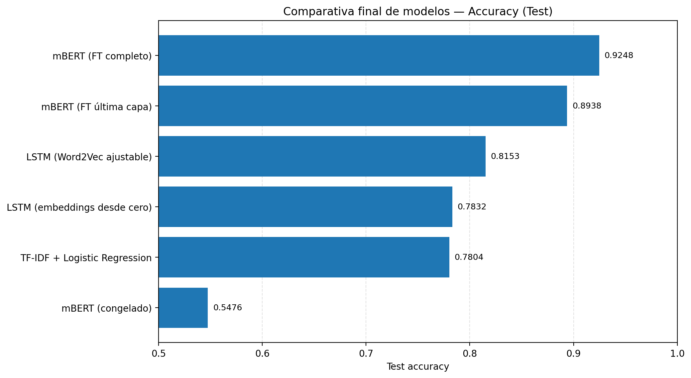

<div align="center">

# Práctica 4 — Procesamiento de Texto (NLP)
### Detección de texto **Humano (0)** vs **IA (1)** con **EDA + ML clásico + Topic Modeling + LSTM + Transformers + Atenciones**

**Laboratorio de Inteligencia Artificial** — **Universidad de Deusto** (curso 2025/2026)  
Pipeline completo en **Google Colab** para **clasificación binaria** (Humano/IA) comparando enfoques **tradicionales**, **Deep Learning secuencial** y **Transformers**, e incluyendo interpretación de **atenciones internas** con `bertviz`.

<p>
  
  
  
  
  
  
</p>

</div>

---

## ⚡ Quickstart

> Ejecuta el notebook en Google Colab:

[](https://colab.research.google.com/drive/1kGrrRnJA9k_1zleUI0RNllDBPvq1yRqq?usp=sharing)

**Dataset:** `Lab_IA_NLP_task.csv` (columnas: `contenido`, `etiqueta`)  
**Etiquetas:** `0 = Humano`, `1 = IA`  
**Imágenes del README:** `./docs/images/`  

> **Convención visual:** todo lo de **Humano** en **verdes** y todo lo de **IA** en **azules**.

---

## Objetivo

Construir y evaluar modelos capaces de distinguir textos **Humanos** vs **Generados por IA**, demostrando comprensión a través de:

- **EDA** con conclusiones interpretables
- **Modelos clásicos** con varias representaciones (BoW / TF-IDF / Word2Vec)
- **Topic Modeling** (LDA y HDP) y relación tópicos–clase
- **LSTM** (embeddings aprendidos vs Word2Vec ajustable)
- **Transformers** con fine-tuning **ligero** vs **completo**
- **Análisis de atenciones** (interpretación, no solo visualización)

---

## Diagrama del pipeline (Mermaid)

```mermaid
---
config:
  layout: elk
---
flowchart TD
  A["Dataset: Lab_IA_NLP_task.csv<br/>(contenido, etiqueta)"] --> B[Split Train / Val / Test]
  B --> C[Preprocesado]
  C --> C1["Filtro básico<br/>(minúsculas + limpieza + stopwords ES)"]
  C --> C2["Filtro extendido<br/>(básico + muletillas corpus)"]
  C2 --> D["EDA cualitativo<br/>(n-gramas, wordclouds,<br/>inspección estilo)"]
  C1 --> D2["EDA cuantitativo<br/>(longitud, TTR,<br/>comparación clases)"]
  C1 --> E[ML clásico]
  E --> E1[BoW + LR / NB / SVM]
  E --> E2["TF-IDF (1–3 ngram) + LR / NB / SVM"]
  E --> E3["Word2Vec (promedio doc) + LR / SVM RBF"]
  C1 --> F[Topic Modeling]
  F --> F1["LDA (k=5)<br/>+ análisis tópicos–clase"]
  F --> F2["HDP<br/>(nº tópicos alto, menos interpretable)"]
  C1 --> G["DL secuencial (BiLSTM)"]
  G --> G1["Exp 1: Embeddings aprendidos"]
  G --> G2["Exp 2: Word2Vec inicial<br/>+ embeddings ajustables"]
  B --> H["Transformers (BERT multilingual)"]
  H --> H1["Exp 1.1: BERT congelado<br/>(solo cabeza)"]
  H --> H2["Exp 1.2: Descongelar última capa"]
  H --> H3["Exp 2: Fine-tuning completo"]
  H3 --> I["Requisito extra: Atenciones (bertviz)"]
  H2 --> I
  I --> I1["Casos: TP/TN/FN/FP<br/>+ interpretación tokens atendidos"]
  E1 --> R["Resultados globales<br/>(accuracy/F1, comparación)"]
  E2 --> R
  E3 --> R
  F1 --> R
  G2 --> R
  H2 --> R
  H3 --> R
  R --> S["Conclusión: señal principal = estilo<br/>Modelos con contexto > BoW"]
````

---

## Tabla de contenidos

* [1. Dataset y preparación](#1-dataset-y-preparación)
* [2. EDA y preprocesado](#2-eda-y-preprocesado)
* [3. Modelos clásicos (ML)](#3-modelos-clásicos-ml)
* [4. Topic Modeling](#4-topic-modeling)
* [5. LSTM (DL secuencial)](#5-lstm-dl-secuencial)
* [6. Transformers (BERT fine-tuning)](#6-transformers-bert-fine-tuning)
* [7. Requisito extra: análisis de atenciones](#7-requisito-extra-análisis-de-atenciones)
* [8. Resultados globales](#8-resultados-globales)
* [9. Estructura del proyecto](#9-estructura-del-proyecto)
* [10. Autoría](#10-autoría)

---

## 1. Dataset y preparación

* Total de filas: **9037**
* Columnas:

  * `contenido`: texto
  * `etiqueta`: clase (`0` humano, `1` IA)
* No hay nulos en las columnas principales.
* Distribución aproximada de clases:

  * `IA`: ~0.529
  * `Humano`: ~0.471

<div align="center">
  
  <p><i>Distribución de clases en Train/Val. Humano en verde, IA en azul.</i></p>
</div>

---

## 2. EDA y preprocesado

### 2.1. Doble filtrado (decisión clave)

Para mantener **coherencia** entre modelos y, a la vez, mejorar la **interpretabilidad** del EDA, se definen dos variantes:

* **Filtro básico (para modelos)**: minúsculas + limpieza + stopwords NLTK (español).
  Se usa en **BoW/TF-IDF/Word2Vec/LSTM** porque:

  * conserva información útil para entrenar,
  * y TF-IDF ya atenúa términos demasiado frecuentes (`max_df`).

* **Filtro extendido (para EDA cualitativo)**: básico + muletillas frecuentes del corpus (p. ej. “primero”, “importante”, “presentamos”, “embargo”, ruido “x”, etc.).
  Se usa en **n-gramas** y **wordclouds** para revelar vocabulario más informativo (menos dominado por plantillas).

**Hallazgo:** el filtrado básico reduce longitudes ~50%; el extendido reduce unas pocas palabras más → las muletillas están presentes y afectan a la interpretación, pero no dominan por completo.

### 2.2. Señales encontradas (conclusión interpretativa)

* **Longitud**: muy similar entre clases → no discrimina bien por sí sola.
* **Estilo**:

  * **IA**: plantillas más estandarizadas, conectores y tono guía (“en primer lugar”, “sin embargo”, “es importante…”).
  * **Humano**: más referencias concretas y acciones/objetos (“agua tibia”, “peine”, “cabello”…).
* **TTR**: alto en ambas clases y diferencias pequeñas → la separación no está en “más/menos vocabulario”, sino en **qué vocabulario** y **cómo se estructura**.

<div align="center">
  
  <p><i>Comparación de top n-gramas (filtro básico): en IA se observan plantillas y conectores; en Humano, referencias más concretas.</i></p>
</div>

---

## 3. Modelos clásicos (ML)

### 3.1. Representaciones comparadas

* **BoW**: conteos (rápido, pierde contexto).
* **TF-IDF (1–3 n-grams)**: penaliza términos globalmente frecuentes y captura expresiones multi-palabra (clave según el EDA).
* **Word2Vec (promedio por documento)**: denso, pero el promediado destruye el orden y aplana el estilo.

### 3.2. Modelos

* Logistic Regression
* Naive Bayes *(solo BoW/TF-IDF)*
* SVM lineal *(y SVM RBF para Word2Vec)*

**Conclusión:** TF-IDF mejora consistentemente a BoW. Word2Vec promediado empeora porque borra justo lo más discriminativo del corpus: el **estilo secuencial/instructivo**.

---

## 4. Topic Modeling

Se estudia estructura **no supervisada** del corpus:

* **LDA (5 tópicos)**: interpretable, coherencia ~0.49 y tópicos semánticamente razonables (incluye un tópico fuerte de “estilo instructivo”).
* **HDP**: genera demasiados tópicos (~150), menos interpretable; tiende a concentrar muchos documentos en un “tópico 0”.

### 4.1. Relación tópicos–clase (LDA)

El tópico “estilo instructivo” concentra un porcentaje mayor de textos IA (≈45%) frente a humanos (≈21%), validando desde no-supervisado lo observado en el EDA: **la diferencia principal es el estilo**.

---

## 5. LSTM (DL secuencial)

Motivación: modelos clásicos pierden orden; aquí el orden importa (EDA).
Se entrenan dos variantes (misma arquitectura para comparar de forma justa):

* **LSTM Exp. 1**: embeddings aprendidos desde cero.
* **LSTM Exp. 2**: embeddings inicializados con **Word2Vec** y **ajustables** (fine-tuning).

**Resultado:** Word2Vec ajustable mejora accuracy/F1 y reduce falsos positivos/negativos: parte con una base semántica y se centra en aprender señal discriminativa.

---

## 6. Transformers (BERT fine-tuning)

Modelo base: `bert-base-multilingual-cased` + tokenización HuggingFace (máx. 256 tokens).

### 6.1. Experimento 1 — Fine-tuning “ligero”

* **1.1. BERT totalmente congelado** (solo cabeza): colapsa (predice casi todo como IA) → rendimiento ~0.54.
* **1.2. Descongelar última capa**: salto enorme (~0.88). Con muy poco coste extra, se adapta al estilo del corpus.

### 6.2. Experimento 2 — Fine-tuning completo

Se entrenan **todas** las capas → mejor rendimiento (~0.92), pero coste computacional mayor (≈18–20 min vs ≈8 min en parcial).

**Conclusión práctica:** descongelar últimas capas es el “punto dulce” coste/rendimiento; el ajuste completo solo compensa si esos puntos extra son críticos.

---

## 7. Requisito extra: análisis de atenciones

Se utiliza `bertviz` para inspeccionar **qué tokens** reciben más atención (especialmente alrededor de `[CLS]`), analizando:

* **Acierto IA → IA**
* **Acierto Humano → Humano**
* **Falso negativo IA → Humano**
* **Falso positivo Humano → IA**

**Hallazgo interpretativo:**

* El modelo atiende con fuerza a **conectores** y **muletillas** típicas de guía (“sin embargo”, “por eso”, “importante”, “primero”…), alineado con el EDA.
* Si una IA escribe sin conectores y con estilo imperativo/concreto → suben **falsos negativos**.
* Si un humano escribe muy normativo/técnico → suben **falsos positivos**.

---

## 8. Resultados globales

> Valores aproximados observados según ejecuciones reportadas en el cuaderno.

### 8.1. Tabla resumen (todos los modelos)

| Familia       | Modelo        | Representación / Config | Accuracy (test) | Comentario                                    |
| ------------- | ------------- | ----------------------- | --------------: | --------------------------------------------- |
| Clásico       | LR / NB / SVM | BoW                     |           ~0.76 | Baseline rápido, pierde contexto              |
| Clásico       | LR / NB / SVM | TF-IDF (1–3 n-grams)    |           ~0.78 | Mejor clásico: pondera ruido + capta fórmulas |
| Clásico       | LR / SVM RBF  | Word2Vec promedio       |           ~0.65 | Pierde estilo/orden por el promedio           |
| DL secuencial | BiLSTM        | Embeddings aprendidos   |           ~0.79 | Captura secuencia, mejora a clásicos          |
| DL secuencial | BiLSTM        | Word2Vec ajustable      |           ~0.82 | Mejor LSTM, más equilibrio                    |
| Transformer   | BERT          | Congelado 100%          |           ~0.54 | Colapsa hacia IA                              |
| Transformer   | BERT          | Última capa entrenable  |           ~0.88 | Gran salto coste/rendimiento                  |
| Transformer   | BERT          | Fine-tuning completo    |           ~0.92 | Mejor global, mayor coste                     |

<div align="center">
  
  <p><i>Comparación de accuracy final entre familias/modelos.</i></p>
</div>

**Idea central:** en este dataset la señal clave no es el tema ni la longitud, sino el **estilo discursivo**. Por eso los modelos que capturan contexto y estructura (LSTM/Transformers) superan a los enfoques basados en bolsa de palabras.

---

## 9. Estructura del proyecto

```text
P04-procesamiento-texto/
├── docs/
│   └── images/
├── data/
│   └── raw
│       └── Lab_IA_NLP_task.csv
├── notebook/
│   └── Práctica_04_Procesamiento_texto.ipynb
└── README.md
```

---

## 10. Autoría

Práctica realizada por:
**Katrin Muñoz Errasti** — Universidad de Deusto (Laboratorio de IA, 2025/2026)
