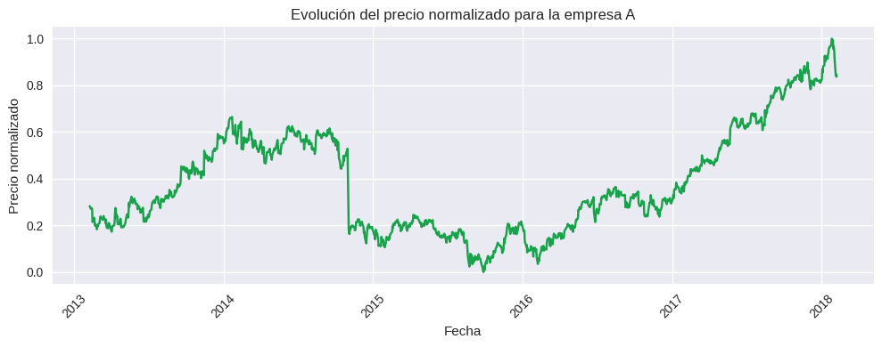
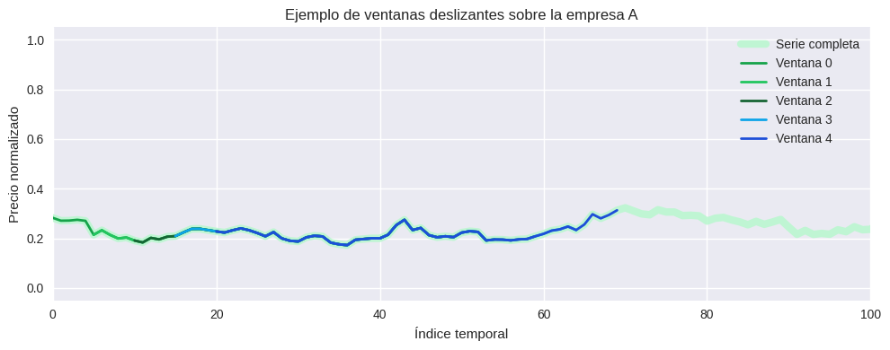
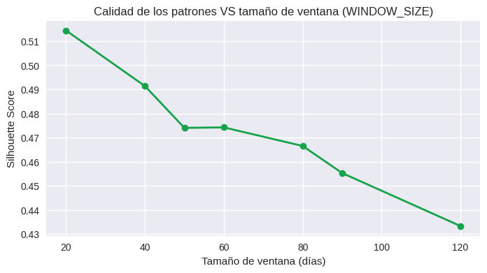
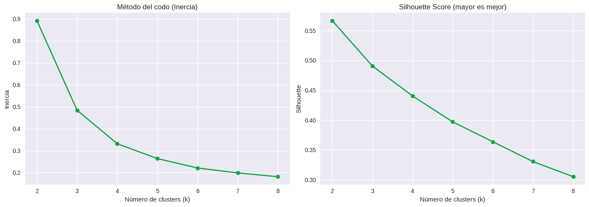
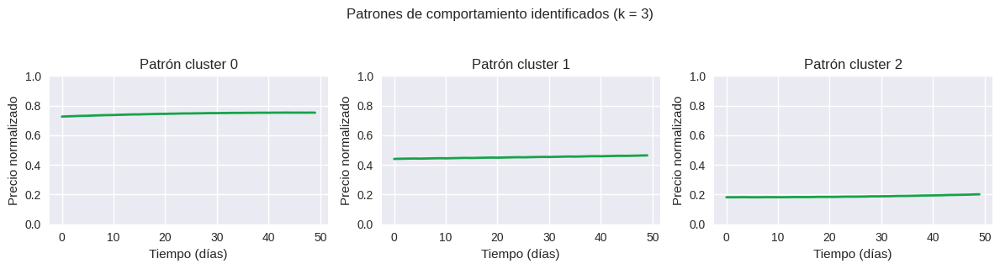
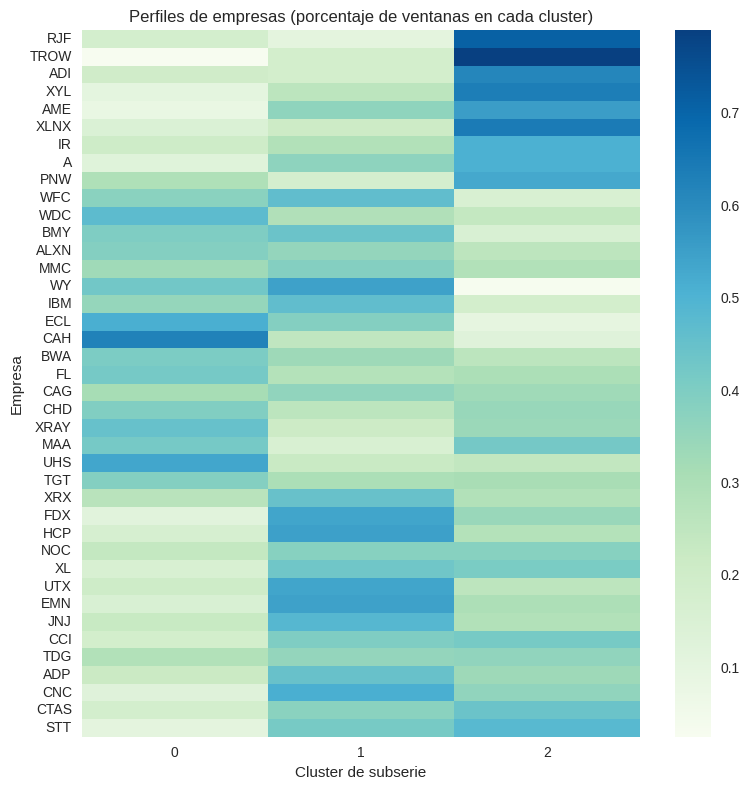
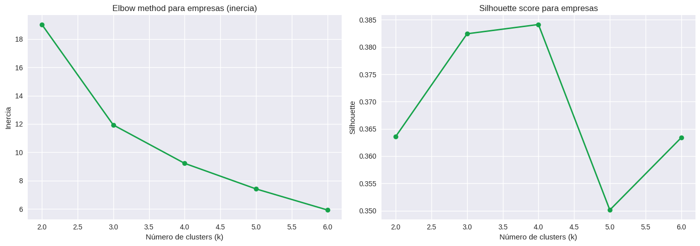
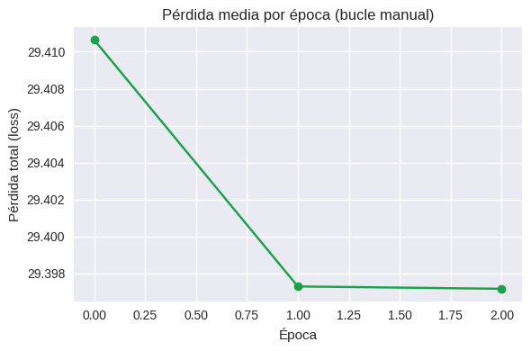
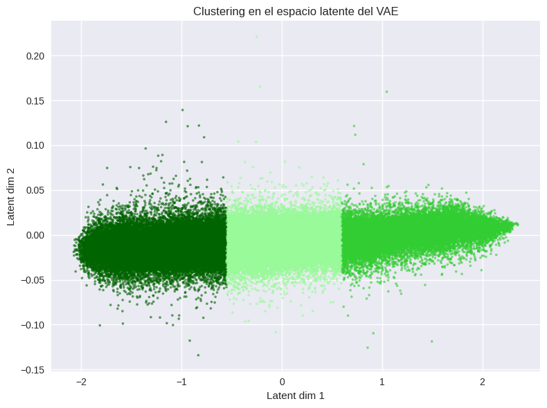
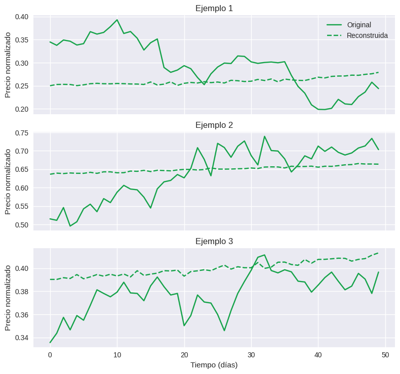

<div align="center">

# Práctica 5 — Series Temporales
### **Clustering de subseries** en S&P 500 + **perfilado de empresas** (*Bag of Patterns*) + **VAE** y clustering en **espacio latente**

**Laboratorio de Inteligencia Artificial** — **Universidad de Deusto** (curso 2025/2026)  
Pipeline completo en **Google Colab** para transformar series bursátiles en **ventanas**, aprender **patrones temporales** con `TimeSeriesKMeans`, construir **perfiles por empresa** y explorar **compresión + clustering** con un **Variational AutoEncoder (VAE)**.

<p>
  
  
  
  
  
  
</p>

</div>

---

## ⚡ Quickstart

> Ejecuta el notebook en Google Colab:

[](https://drive.google.com/file/d/1EEco7v2E7LW_2GysjM_27587RZR2JE88/view?usp=sharing)

**Dataset:** `S&P 500 stock data.csv`  
**Notebook:** `Práctica_05_Series_temporales.ipynb`  
**Imágenes del README:** `./docs/images/`

---

## Objetivo

Construir un flujo completo de **aprendizaje no supervisado** con series temporales reales:

- Preparar el dataset bursátil (S&P 500) y filtrar empresas con histórico suficiente
- Homogeneizar series con **Min–Max por empresa** (`close → close_scaled`)
- Convertir series en un conjunto masivo de **subseries** con **ventana deslizante**
- Aprender **patrones típicos** con `TimeSeriesKMeans` (clustering de subseries)
- Crear **perfiles por empresa** tipo *Bag of Patterns* y agrupar compañías
- Entrenar un **VAE** para obtener un **espacio latente 2D** y comparar clustering:
  - **espacio original** vs **espacio latente**

---

## Hallazgos principales

- La **normalización Min–Max por empresa** permite que el clustering compare **formas/regímenes** y no precios absolutos.
- Con distancia **euclídea**, `TimeSeriesKMeans` tiende a separar ventanas por **nivel medio** (zona alta / media / baja) de la serie normalizada.
- El enfoque *Bag of Patterns* resume cada empresa con un vector **(k dimensiones)**: % de ventanas en cada patrón, facilitando un clustering de empresas interpretable.
- El **VAE** en 2D genera un espacio latente más “limpio”: el clustering latente mejora la separabilidad (**Silhouette ↑**), aunque las reconstrucciones son **más suaves** (pierde picos rápidos).

---

## Diagrama del pipeline (Mermaid)

```mermaid
---
config:
  layout: elk
---
flowchart TD
  A["Dataset: S&P 500 stock data.csv<br/>(date, open, high, low, close, volume, Name)"] --> B["Limpieza + parseo fechas + ordenación"]
  B --> C["Filtrado empresas (>= 1000 observaciones)"]
  C --> D["Normalización Min–Max por empresa<br/>close → close_scaled"]
  D --> E["Ventana deslizante<br/>WINDOW_SIZE=50, STEP=5"]
  E --> F["Subseries XTrain<br/>(N, 50, 1)"]
  F --> G["Selección k (muestra)<br/>Inercia + Silhouette"]
  G --> H["TimeSeriesKMeans final (k=3, euclidean)"]
  H --> I["Centroides (patrones)"]
  H --> J["Perfiles por empresa (Bag of Patterns)<br/>% ventanas por cluster"]
  J --> K["Clustering de empresas (KMeans, k=4)"]
  F --> L["VAE → espacio latente 2D"]
  L --> M["KMeans en latente (k=3)"]
  L --> O["Reconstrucciones vs originales"]
  M --> P["Comparación Silhouette:<br/>Original vs Latente"]
````

---

## Tabla de contenidos

* [1. Dataset](#1-dataset)
* [2. Preprocesado](#2-preprocesado)
* [3. Ventanas deslizantes](#3-ventanas-deslizantes)
* [4. Clustering de subseries](#4-clustering-de-subseries)
* [5. Perfilado y clustering de empresas](#5-perfilado-y-clustering-de-empresas)
* [6. VAE y clustering en el espacio latente](#6-vae-y-clustering-en-el-espacio-latente)
* [7. Estructura del proyecto](#7-estructura-del-proyecto)
* [8. Autoría](#8-autoría)

---

## 1. Dataset

* Filas totales: **619,040**
* Empresas (`Name`) en el dataset original: **505**
* Rango temporal: **2013-02-08 → 2018-02-07**
* Columnas: `date`, `open`, `high`, `low`, `close`, `volume`, `Name`

<div align="center">
  
  <p><i>Ejemplo: evolución del precio normalizado (Min–Max) para una empresa.</i></p>
</div>

---

## 2. Preprocesado

Decisiones clave:

1. **Limpieza y ordenación**

   * Conversión robusta de fechas
   * Eliminación de registros corruptos
   * Orden por `Name` y `date`

2. **Filtrado de empresas con suficiente histórico**

   * Criterio: **≥ 1000 observaciones**
   * Resultado (según ejecución): **483 empresas** tras filtrado

3. **Normalización Min–Max por empresa**

   * `close → close_scaled` en **[0,1]**
   * Beneficio: el clustering se centra en la **forma** (tendencias/régimen) y no en escalas absolutas.

---

## 3. Ventanas deslizantes

### 3.1 Parámetros finales

* `WINDOW_SIZE = 50`
* `STEP = 5`

<div align="center">
  
  <p><i>Ejemplo de segmentación en ventanas deslizantes sobre una serie normalizada.</i></p>
</div>

### 3.2 Elección de `WINDOW_SIZE`

Se evalúa cómo cambia la **calidad de los patrones** (Silhouette) al variar `WINDOW_SIZE`:

<div align="center">
  
  <p><i>Silhouette disminuye al usar ventanas demasiado largas: más contexto pero menos separabilidad.</i></p>
</div>

**Decisión:** `WINDOW_SIZE=50` como compromiso entre:

* contexto temporal suficiente (tendencias locales)
* Silhouette todavía alto en el rango 40–60
* evitar ventanas demasiado largas que mezclen comportamientos

---

## 4. Clustering de subseries

### 4.1 Selección de k (Elbow + Silhouette)

Se explora `k=2…8` sobre una muestra de subseries para reducir coste:

<div align="center">
  
  <p><i>Elbow + Silhouette para subseries.</i></p>
</div>

**Por qué `k=3` (aunque Silhouette sea máximo en k=2):**

* `k=2` tiende a producir una partición **demasiado general** (menos granularidad).
* `k=3` coincide con un **codo claro** en inercia (3–4) y mantiene Silhouette razonable.
* La inspección de centroides en `k=3` produce patrones **fáciles de explicar**: zona alta / media / baja del precio normalizado.

### 4.2 Patrones finales (centroides)

<div align="center">
  
  <p><i>Centroides/patrones identificados (k=3) en series normalizadas.</i></p>
</div>

**Lectura cualitativa:**

* **Cluster alto**: ventanas con nivel medio alto (~0.75)
* **Cluster medio**: ventanas alrededor de ~0.45–0.50
* **Cluster bajo**: ventanas alrededor de ~0.18–0.20
  En general, aparecen centroides bastante estables con ligera tendencia positiva.

---

## 5. Perfilado y clustering de empresas

### 5.1 Bag of Patterns (perfil por empresa)

Cada empresa se representa por el **porcentaje de ventanas** asignadas a cada cluster de subseries.

<div align="center">
  
  <p><i>Heatmap de perfiles: distribución de ventanas de cada empresa en los clusters de subseries.</i></p>
</div>

**Interpretación rápida del heatmap:**

* Empresas “mono-patrón”: una columna domina (pasaron casi todo el tiempo en un régimen).
* Empresas “mixtas”: reparto más equilibrado (alternancia de regímenes).

### 5.2 Selección de `k` para empresas

Se agrupan empresas usando sus perfiles (% en cada patrón) y se evalúa `k`:

<div align="center">
  
  <p><i>Elbow + Silhouette para clustering de empresas (sobre perfiles Bag of Patterns).</i></p>
</div>

**Decisión:** `k=4` porque:

* coincide con el “codo” en la inercia (a partir de ahí mejora marginal)
* ofrece el **mejor Silhouette** observado en el rango evaluado

### 5.3 Tipologías de empresas (lectura interpretativa)

Como los clusters de subseries representan **alto/medio/bajo**, los grupos de empresas tienden a corresponder a tipologías como:

* **Grupo dominancia “alto”**: empresas con gran % de ventanas en cluster alto.
* **Grupo dominancia “medio”**: empresas centradas en el régimen medio.
* **Grupo dominancia “bajo”**: empresas con muchas ventanas en nivel bajo.
* **Grupo mixto**: empresas con alternancia marcada (porcentajes repartidos).

Esta lectura coincide con ejemplos del notebook (p. ej., empresas dominadas por cluster 1 vs empresas más equilibradas).

---

## 6. VAE y clustering en el espacio latente

### 6.1 Pérdida media por época (bucle manual)

<div align="center">
  
  <p><i>Pérdida media por época (bucle manual) para registrar la loss al usar <code>train_step</code> personalizado.</i></p>
</div>

### 6.2 Clustering en el espacio latente (2D)

<div align="center">
  
  <p><i>Clustering en el espacio latente del VAE (2D). Se observan bandas/zona de densidad que KMeans separa en k=3.</i></p>
</div>

### 6.3 Reconstrucciones (original vs reconstruida)

<div align="center">
  
  <p><i>El VAE captura nivel + tendencia, pero suaviza oscilaciones rápidas (picos/caídas).</i></p>
</div>

### 6.4 Comparación cuantitativa (Silhouette)

En una ejecución del notebook:

* **Espacio original (subseries aplanadas + TimeSeriesKMeans):** ~**0.486**
* **Espacio latente (ZMean 2D + KMeans):** ~**0.553**

**Lectura:** el latente ayuda a separar mejor grupos al reducir ruido y concentrar información relevante en 2D.

---

## 7. Estructura del proyecto

```text
P05-series-temporales/
├── docs/
│   └── images/
├── data/
│   └── raw/
│       └── S&P 500 stock data.csv
├── notebook/
│   └── Práctica_05_Series_temporales.ipynb
└── README.md
```

---

## 8. Autoría

Práctica realizada por:
**Katrin Muñoz Errasti** — Universidad de Deusto (Laboratorio de IA, 2025/2026)
