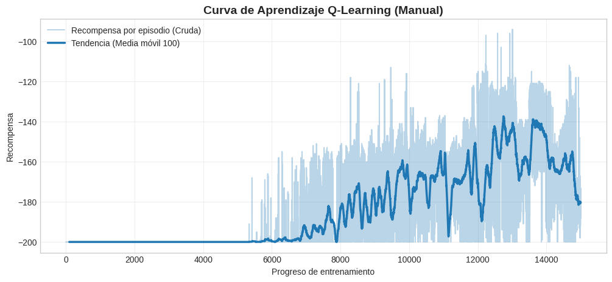
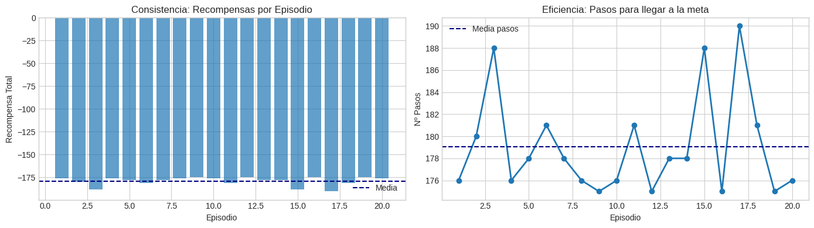
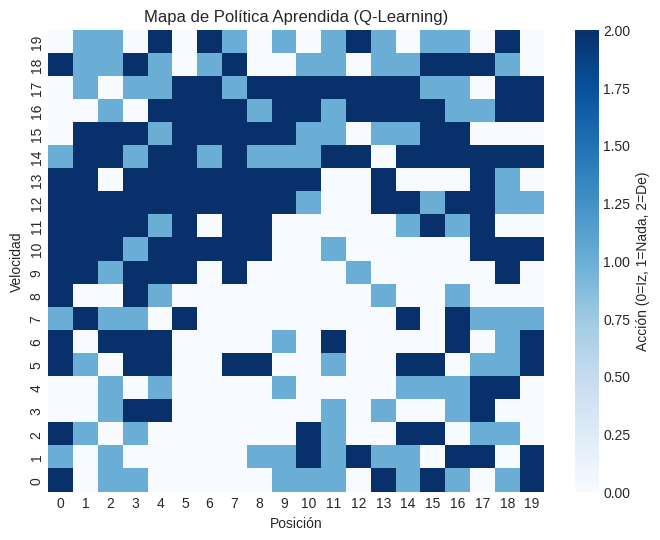
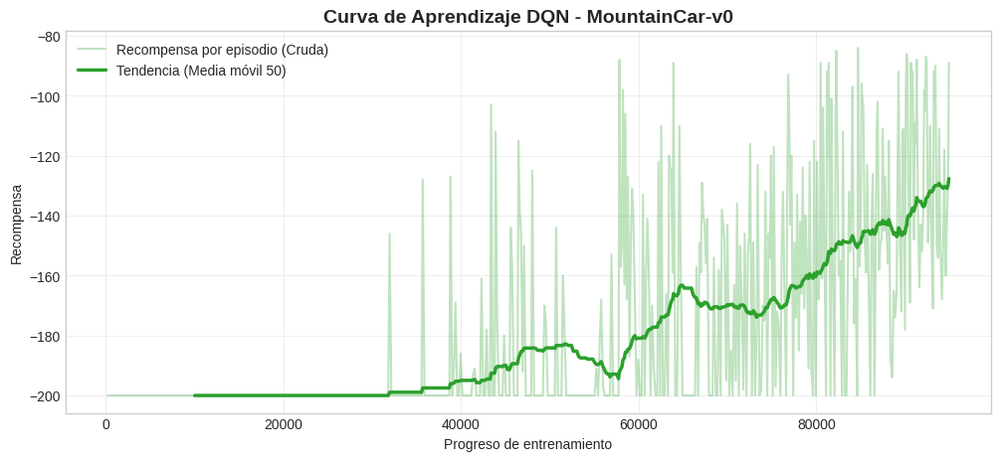
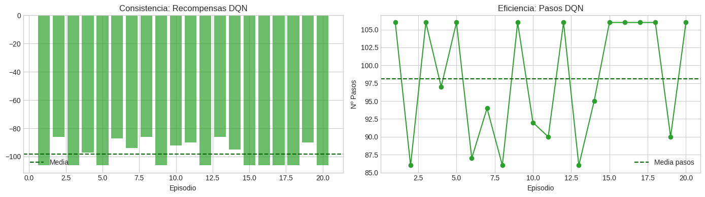

<div align="center">

# Práctica 6 — Reinforcement Learning
### Resolución de **MountainCar-v0** con **Q-Learning tabular (discretización)** vs **DQN (Deep RL)**

**Laboratorio de Inteligencia Artificial** — **Universidad de Deusto** (curso 2025/2026)  
Comparativa completa entre un enfoque **clásico** (Q-table con buckets) y un enfoque **Deep Reinforcement Learning** (**DQN** con Stable-Baselines3), con métricas, visualizaciones y evidencias.

<p>
  
  
  
  
</p>

</div>

---

## ⚡ Quickstart

[](https://colab.research.google.com/drive/1nY6Swf_hZ8A9Y3v_FOUotUELByYzvGlz?usp=sharing)

Carpeta del proyecto: **`P06-Reinforcement_learning`**  
Convención visual: **Q-Learning = azul** · **DQN = verde**  
Se incluyen **dos vídeos** (uno por enfoque).

---

## Objetivo

Resolver el entorno **MountainCar-v0**, donde el coche debe alcanzar la cima derecha (posición ≥ 0.5).  
Como el motor no tiene fuerza suficiente para subir directamente, la política óptima consiste en **balancearse**: retroceder para ganar velocidad y luego acelerar hacia arriba.

- **Requisito básico:** llegar a la cima.  
- **Deseable:** hacerlo en el menor número de pasos.  
- **Extra:** aplicar un método **Deep RL** (DQN) y compararlo con Q-Learning tabular.

---

## Diagrama del pipeline (Mermaid)

```mermaid
---
config:
  layout: elk
---
flowchart TD
  A["MountainCar-v0<br/>(estado continuo: posición, velocidad)"] --> B["Setup (Colab vs Local)<br/>instalación + render vídeo"]
  B --> C["Q-Learning tabular<br/>(discretización BUCKETS)"]
  B --> D["DQN (SB3)<br/>(estado continuo)"]
  C --> E["Evaluación + gráficas + vídeo"]
  D --> F["Evaluación + gráficas + vídeo"]
  E --> G["Comparativa final"]
  F --> G
````

---

## Tabla de contenidos

* [1. Entorno y preparación](#1-entorno-y-preparación)
* [2. Enfoque 1 — Q-Learning manual (tabular)](#2-enfoque-1--q-learning-manual-tabular)
* [3. Enfoque 2 — DQN (Deep Q-Network)](#3-enfoque-2--dqn-deep-q-network)
* [4. Resultados y comparativa](#4-resultados-y-comparativa)
* [5. Evidencias y archivos](#5-evidencias-y-archivos)
* [6. Estructura del proyecto](#6-estructura-del-proyecto)
* [7. Autoría](#7-autoría)

---

## 1. Entorno y preparación

### 1.1 MountainCar-v0 en una frase

Cada paso penaliza (≈ **-1**) y el episodio termina en éxito (posición ≥ 0.5) o al llegar al máximo de pasos (recompensa ≈ **-200**).
Por tanto, *resolver* el entorno significa **aprender el balanceo** y, además, hacerlo **con pocos pasos**.

### 1.2 Setup Colab vs Local + librerías

El notebook detecta **Colab** automáticamente para instalar dependencias de renderizado (xvfb/ffmpeg) y poder grabar vídeo con `RecordVideo`. En local, asume el entorno ya preparado.

Librerías principales:

* `gymnasium`, `RecordVideo`
* `stable-baselines3` (DQN)
* `Monitor`, `EvalCallback`, `StopTrainingOnRewardThreshold`
* `numpy`, `matplotlib`, `seaborn`

---

## 2. Enfoque 1 — Q-Learning manual (tabular)

### 2.1 Idea central

`MountainCar-v0` entrega un estado continuo (posición, velocidad), pero Q-Learning tabular necesita estados discretos.
Por eso se discretiza el espacio en una rejilla:

* `BUCKETS = (20, 20)` → 20 divisiones en posición × 20 en velocidad
* Se aprende una **Q-table**: `Q[pos_bucket, vel_bucket, acción]`

La política de entrenamiento es **epsilon-greedy** (explorar al inicio, explotar al final) y la actualización se realiza con Bellman:

* `Q(s,a) ← (1-α)Q(s,a) + α(r + γ max_a' Q(s',a'))`

### 2.2 Lo que se observa durante el aprendizaje

La curva de aprendizaje muestra un patrón muy característico en entornos con recompensa escasa: durante miles de episodios el agente se mantiene en **-200**, hasta que por exploración descubre trayectorias que se acercan a la cima y la media móvil empieza a subir.

<div align="center">
  
  <p><i>Q-Learning (azul): recompensa por episodio (cruda) + media móvil (tendencia).</i></p>
</div>

### 2.3 Evaluación: consistencia y eficiencia

Para evaluar la política final, se desactiva la exploración (política greedy pura) y se ejecutan 20 episodios.
Aquí interesa ver **dos cosas a la vez**:

* *Consistencia*: ¿resuelve el problema de forma repetible o depende mucho del azar?
* *Eficiencia*: cuando lo resuelve, ¿lo hace con pocos pasos?

<div align="center">
  
  <p><i>Q-Learning (azul): recompensas por episodio y pasos para llegar a la meta (20 episodios).</i></p>
</div>

### 2.4 Interpretación de la política aprendida

Un punto fuerte del enfoque tabular es que permite “abrir la caja” y visualizar qué acción elige el agente en cada región discretizada del espacio posición-velocidad.

<div align="center">
  
  <p><i>Mapa de política Q-Learning: acción elegida en cada celda (0=Izq, 1=Nada, 2=Der).</i></p>
</div>

---

## 3. Enfoque 2 — DQN (Deep Q-Network)

### 3.1 Idea central

DQN evita discretizar y aprende directamente sobre el estado continuo mediante una red neuronal MLP que aproxima `Q(s,a)`.
Esto permite una política más fina y suele mejorar estabilidad y eficiencia.

Además, incorpora mecanismos que estabilizan el aprendizaje:

* replay buffer
* target network
* epsilon scheduling

### 3.2 Ajustes clave realizados en la práctica

En este entorno, la estabilidad depende fuertemente de los hiperparámetros:

* **Learning rate:** 0.01 provocaba oscilaciones y estancamiento en -200 → se redujo a **4e-3**.
* **Best model:** se implementó `EvalCallback` para guardar automáticamente el **mejor checkpoint** (`best_model`).
* **Parada temprana:** `StopTrainingOnRewardThreshold` con umbral **-110** para detener al converger (reduciendo el tiempo total).
* **Exploración:** ajustar `exploration_fraction` permitió descubrir la meta mucho antes y acelerar el ciclo completo.

### 3.3 Evolución del entrenamiento

La curva verde refleja tres fases típicas:

1. estancamiento inicial mientras se llena el buffer
2. primera mejora al “descubrir” el balanceo
3. mejora acelerada y estabilización

<div align="center">
  
  <p><i>DQN (verde): recompensa durante entrenamiento (cruda) + media móvil (tendencia).</i></p>
</div>

### 3.4 Evaluación: consistencia y eficiencia

En evaluación determinista (20 episodios), la diferencia clave se ve en dos señales:

* barras con recompensas muy similares (baja varianza)
* pasos claramente más bajos que en Q-Learning

<div align="center">
  
  <p><i>DQN (verde): recompensas y pasos por episodio (20 episodios). Alta consistencia.</i></p>
</div>

---

## 4. Resultados y comparativa

### 4.1 Métricas (20 episodios, evaluación determinista)

| Métrica                   | Q-Learning Manual (azul) | DQN SB3 (verde) |
| ------------------------- | -----------------------: | --------------: |
| Representación del estado | Discreta (rejilla 20×20) |  Continua (MLP) |
| Tiempo de entrenamiento   |                   ~3 min |          ~6 min |
| Tasa de éxito (20 ep.)    |              85% (17/20) |    100% (20/20) |
| Recompensa media (20 ep.) |                  -164.15 |          -98.15 |
| Pasos medios (20 ep.)     |                   164.15 |           98.15 |
| Estabilidad               |            Varianza alta |     Consistente |

### 4.2 Conclusión técnica

* **Q-Learning** es útil como baseline y para interpretar la política, pero la discretización limita el control fino y aumenta la variabilidad.
* **DQN** domina el problema: al trabajar sobre estado continuo, aprende un control más preciso del balanceo, logra **100% éxito** y reduce pasos de ~164 a ~98.

---

## 5. Evidencias y archivos

### 5.1 Vídeos (subir ambos)

* `./docs/videos/qlearning_evidence.mp4` — demostración con política greedy Q-Learning
* `./docs/videos/dqn_evidence.mp4` — demostración DQN determinista (modelo best)

> Recomendación: si pesan mucho, subirlos como *Release assets* o usando Git LFS.

### 5.2 Imágenes incluidas en el README

Guardar en `./docs/images/`:

* `qlearning_learning_curve.png`
* `qlearning_eval_consistency_efficiency.png`
* `qlearning_policy_map.png`
* `dqn_learning_curve.png`
* `dqn_eval_consistency_efficiency.png`

---

## 6. Estructura del proyecto

```text
P06-Reinforcement_learning/
├── docs/
│   ├── images/
│   └── videos/
├── notebook/
│   └── Práctica_06_Reinforcement_learning.ipynb
└── README.md
```

---

## 7. Autoría

Práctica realizada por:
**Katrin Muñoz Errasti** — Universidad de Deusto (Laboratorio de IA, 2025/2026)
