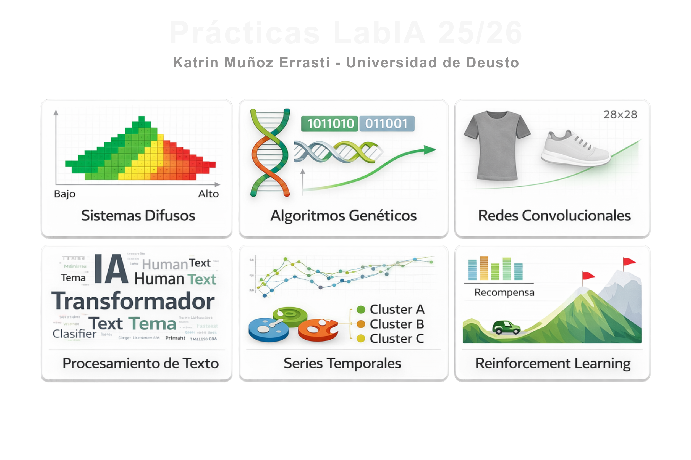

  

---

## Portfolio de Inteligencia Artificial  
**Katrin Muñoz Errasti · Universidad de Deusto**

Este repositorio presenta una colección de **proyectos prácticos de Inteligencia Artificial**, desarrollados a lo largo del curso 2025/2026.  
El objetivo no es únicamente implementar algoritmos, sino **analizar, comparar y aplicar distintas técnicas de IA** a problemas reales y datasets representativos.

Las prácticas abarcan tanto **IA clásica** como **Deep Learning**, siguiendo un enfoque progresivo desde modelos interpretables hasta arquitecturas más complejas.

---

## Áreas trabajadas

- Sistemas de inferencia difusa
- Algoritmos evolutivos y optimización
- Visión artificial con redes neuronales convolucionales
- Procesamiento de lenguaje natural
- Análisis y modelado de series temporales
- Aprendizaje por refuerzo y control

Cada proyecto incluye:
- Notebook ejecutable (Google Colab o local)
- Explicación metodológica
- Análisis de resultados y visualizaciones
- Documentación técnica clara y estructurada

---

## Resumen de proyectos

| Proyecto | Técnica principal | Problema abordado | Enlaces |
|---|---|---|---|
| **Lógica Difusa** | Sistemas difusos | Segmentación de clientes en retail | [README](./P01-%20logica_difusa/README.md) · [Colab](https://colab.research.google.com/drive/1ruykcEmRXXTY-H-4MhMYp8vauJ88DJfW) |
| **Algoritmos Genéticos** | Optimización evolutiva | Selección óptima de cestas de productos | [README](./P02-algoritmos_geneticos/README.md) · [Colab](https://colab.research.google.com/drive/1cIxw0WI3K3NtY1zSIRw_XrghZezxTzq5) |
| **CNNs** | Deep Learning | Clasificación de imágenes (Fashion-MNIST) | [README](./P03-Image_processing/README.md) · [Colab](https://colab.research.google.com/drive/1jsZr0jfd-R1UQV-Abvkv_dDz1Wik-ysg) |
| **NLP** | ML + Transformers | Detección de texto humano vs IA | [README](./P04-Procesamiento_texto/README.md) · [Colab](https://colab.research.google.com/drive/1kGrrRnJA9k_1zleUI0RNllDBPvq1yRqq) |
| **Series Temporales** | Clustering + VAE | Análisis de series financieras (S&P 500) | [README](./P05-Series_temporales/README.md) · [Notebook](https://drive.google.com/file/d/1EEco7v2E7LW_2GysjM_27587RZR2JE88) |
| **Reinforcement Learning** | Q-Learning y DQN | Control en entorno MountainCar-v0 | [README](./P06-Reinforcement_learning/README.md) · [Colab](https://colab.research.google.com/drive/1nY6Swf_hZ8A9Y3v_FOUotUELByYzvGlz) |

---

## Descripción de proyectos

### Sistemas Difusos — Segmentación de clientes
Diseño de un sistema de inferencia difusa con variables lingüísticas y reglas interpretables para clasificar clientes según su comportamiento de compra.  
Se analiza el valor de los sistemas difusos frente a enfoques puramente numéricos en problemas con incertidumbre.

---

### Algoritmos Genéticos — Optimización combinatoria
Implementación de un algoritmo genético para resolver un problema de selección óptima bajo múltiples criterios.  
Se estudia el impacto de los operadores evolutivos y la definición de la función de fitness en la calidad de las soluciones.

---

### Redes Neuronales Convolucionales — Visión artificial
Comparativa entre modelos entrenados desde cero y modelos con Transfer Learning aplicados a Fashion-MNIST.  
Incluye análisis experimental, data augmentation y estudio del comportamiento interno de las redes.

---

### Procesamiento de Lenguaje Natural — Texto humano vs IA
Pipeline completo de NLP que combina análisis exploratorio, modelos clásicos, redes LSTM y Transformers.  
Se incorporan técnicas de interpretación para entender las decisiones del modelo en un contexto actual y relevante.

---

### Series Temporales — Análisis financiero
Segmentación y clustering de subseries temporales utilizando representaciones simbólicas y modelos en espacio latente.  
El proyecto explora patrones de comportamiento y perfiles temporales en datos reales del mercado financiero.

---

### Aprendizaje por Refuerzo — Control y decisión
Resolución del entorno MountainCar-v0 mediante Q-Learning tabular y Deep Q-Networks.  
Se comparan ambos enfoques y se analizan las dificultades prácticas del aprendizaje por refuerzo en espacios continuos.

---

## Tecnologías y herramientas

- Python
- NumPy, Pandas, Matplotlib, Seaborn
- scikit-learn
- TensorFlow / Keras
- PyTorch (cuando aplica)
- Stable-Baselines3
- Google Colab

---

## Aprendizajes clave

- Diferencias prácticas entre modelos interpretables y modelos de Deep Learning.
- Importancia de la representación de los datos y del estado en problemas de IA.
- Limitaciones reales de los modelos cuando se aplican a datos no ideales.
- Valor del análisis experimental frente a una implementación “caja negra”.
